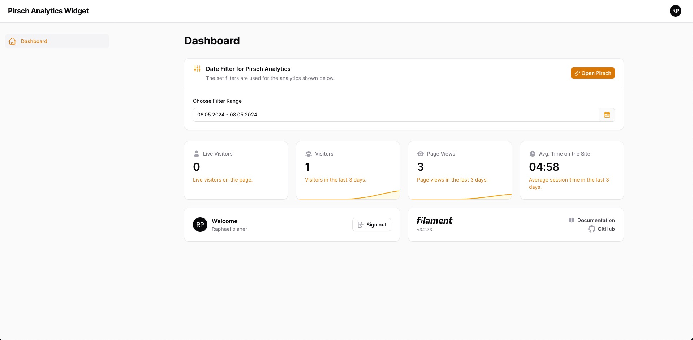
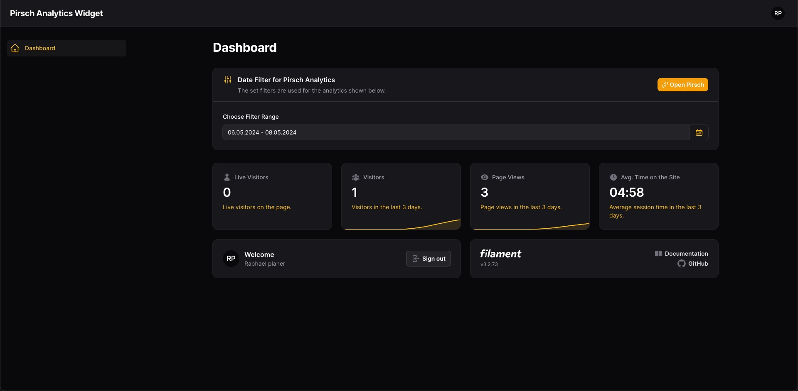

# Filament Pirsch Dashboard Widget

[](https://packagist.org/packages/devlogx/filament-pirsch-dashboard-widget)
[](https://github.com/devlogx/filament-pirsch-dashboard-widget/actions?query=workflow%3Arun-tests+branch%3Amain)
[](https://github.com/devlogx/filament-pirsch-dashboard-widget/actions?query=workflow%3A"Fix+PHP+code+styling"+branch%3Amain)
[](https://packagist.org/packages/devlogx/filament-pirsch-dashboard-widget)

This package allows you to integrate a simple analytics dashboard widget for panel.

## Screenshots



## Installation

You can install the package via composer:

```bash
composer require devlogx/filament-pirsch-dashboard-widget
```

Get the Pirsch access token and add it your `env` file.
1. Visit the [Pirsch "Integration" settings page](https://dashboard.pirsch.io/settings/integration).
2. Make sure the correct domain is selected in the top left corner of the page.
3. Scroll down to the "Clients" section and press the "Add Client" button.
4. Select "oAuth (ID + secret)" as type and enter a description.
5. Press the "Create Client" button and copy the generated "Client id and Client secret".
6. Add the copied id and secret to your `.env` file:

```bash
# ...
PIRSCH_CLIENT_ID=xxxxxxxxxxxxxxxxxxxxxxxxxxxxxxxxxxxxxxxxxxxxx
PIRSCH_CLIENT_SECRET=xxxxxxxxxxxxxxxxxxxxxxxxxxxxxxxxxxxxxxxxxxxxx
```

You can publish the config file with:

```bash
php artisan vendor:publish --tag="filament-pirsch-dashboard-widget-config"
```

Optionally, you can publish the translations using

```bash
php artisan vendor:publish --tag="filament-pirsch-dashboard-widget-translations"
```

This is the contents of the published config file:

```php
return [
    "client_id" => env('PIRSCH_CLIENT_ID',null),
    "client_secret" => env('PIRSCH_CLIENT_SECRET',null),
];
```

## Usage

### Create own Dashboard file
Under `Filament/Pages/` create a new file called `Dashboard.php` with following contents:
```php
<?php

namespace App\Filament\Pages;

use Devlogx\FilamentPirsch\Concerns\HasFilter;

class Dashboard extends \Filament\Pages\Dashboard
{
    use HasFilter;
    
}
```

#### Remove the default Dashboard from your PanelProvider
```php
->pages([
    //Pages\Dashboard::class,
])
```
Alternatively if you already have a custom Dashboard, add the `HasFilter` trait to your Dashboard file.

### Add the Widget to your PanelProvider
```php
->widgets([
    Widgets\AccountWidget::class,
    Widgets\FilamentInfoWidget::class,
    \Devlogx\FilamentPirsch\Widgets\PirschStatsWidget::class,// <-- add this widget
])
```

### Add the plugin to your PanelProvider
```php
->plugins([
    \Devlogx\FilamentPirsch\FilamentPirschPlugin::make()
])
```

### Configure the plugin
```php
->plugins([
    \Devlogx\FilamentPirsch\FilamentPirschPlugin::make()
        ->pirschLink(true) //Direct link to pirsch analytics page
        ->pollingInterval("60s") //Auto polling interval
        ->filterSectionIcon("heroicon-s-adjustments-vertical")
        ->filterSectionIconColor("primary")
        ->liveVisitorIcon("heroicon-s-user") //First Block | Live Visitors
        ->liveVisitorColor("primary") //First Block | Live Visitors
        ->visitorsIcon("heroicon-s-user-group") //Second Block | All Visitors
        ->visitorsColor("primary") //Second Block | All Visitors
        ->viewsIcom("heroicon-s-eye") //Third Block | All Page Views
        ->visitorsColor("primary") //Third Block | All Page Views
        ->sessionTimeIcon("heroicon-s-clock") //Fourth Block | Avg. Session Time
        ->sessionTimeColor("primary") //Fourth Block | Avg. Session Time
])
```

## Testing

```bash
composer test
```

## Changelog

Please see [CHANGELOG](CHANGELOG.md) for more information on what has changed recently.

## Contributing

Please see [CONTRIBUTING](.github/CONTRIBUTING.md) for details.

## Security Vulnerabilities

Please review [our security policy](../../security/policy) on how to report security vulnerabilities.

## Credits

- [Develogix Agency](https://github.com/devlogx)
- [All Contributors](../../contributors)

## License

The MIT License (MIT). Please see [License File](LICENSE.md) for more information.
